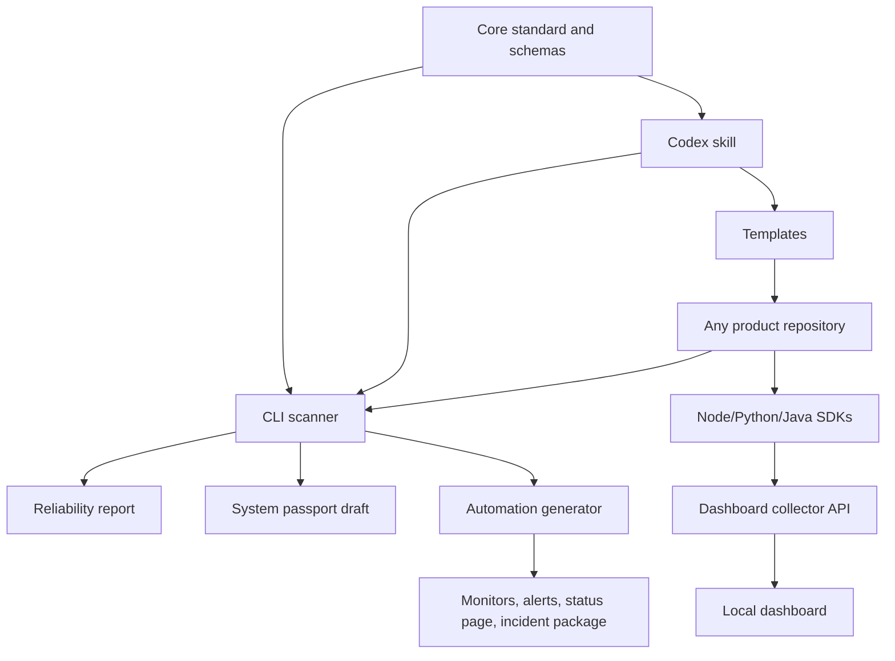
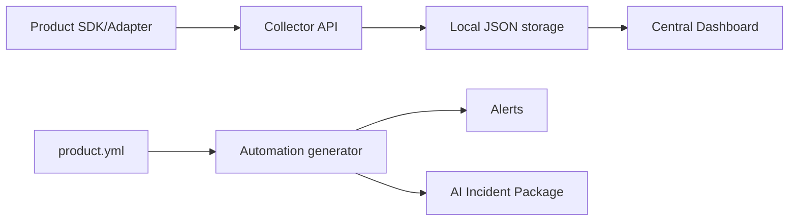

# Architecture

The kit is a monorepo with standards, SDKs, a local dashboard, automation generators, templates, examples, and a Codex skill.

## Components

| Component | Responsibility |
| --- | --- |
| Standard | Defines the contract and compatibility rules. |
| CLI | Scans projects, reports gaps, and generates passport drafts. |
| SDKs | Send product, event, error, health, and release envelopes to collectors. |
| Dashboard | Provides local product inventory, health, event, error, release, monitor, and alert views. |
| Automation | Generates provider-neutral operations artifacts from `product.yml`. |
| Skill | Guides AI agents to audit and improve projects consistently. |
| Templates | Provide reusable docs, CI, product contract, and smoke tests. |
| Examples | Prove the MVP can scan a representative project. |

## Data Flow

