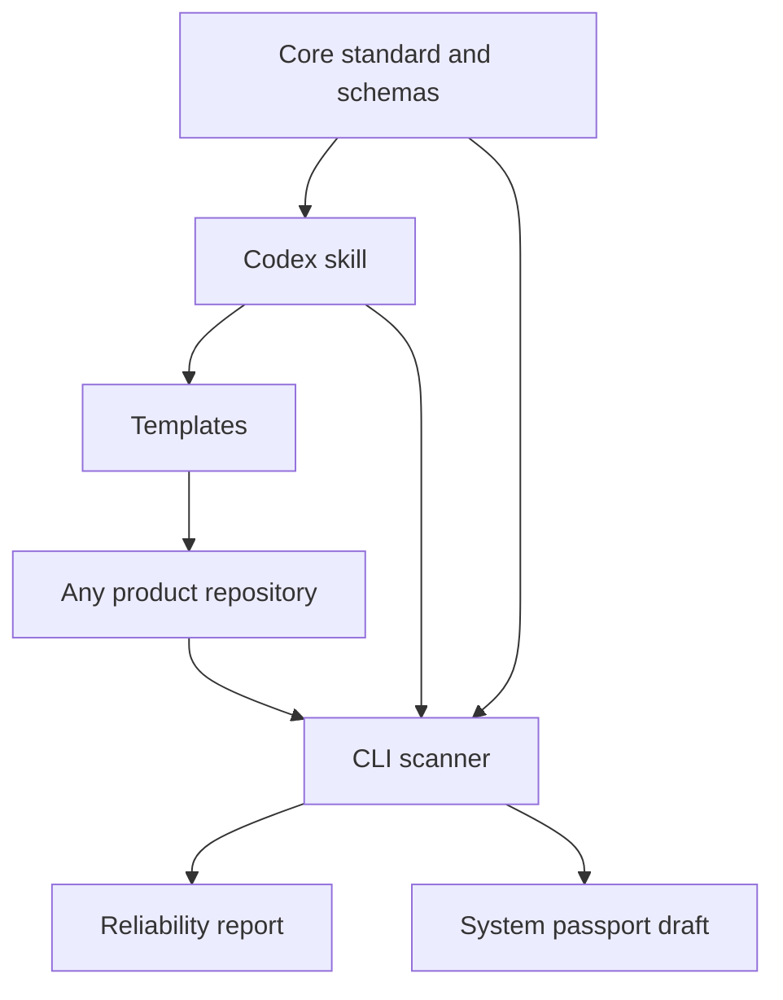
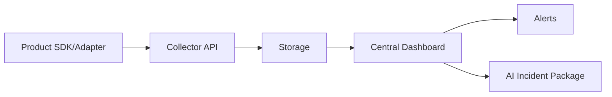

# Architecture

Stage 1 intentionally separates reusable standards from future runtime infrastructure.

## Components

| Component | Responsibility |
| --- | --- |
| Standard | Defines the contract and compatibility rules. |
| CLI | Scans projects, reports gaps, and generates passport drafts. |
| Skill | Guides AI agents to audit and improve projects consistently. |
| Templates | Provide reusable docs, CI, product contract, and smoke tests. |
| Examples | Prove the MVP can scan a representative project. |

## Why No Central Dashboard Yet

The dashboard depends on stable product contracts and event semantics. Stage 1 creates those foundations first. Later phases can ingest `product.yml`, events, errors, uptime checks, and release metadata into one dashboard.

## Future Data Flow

