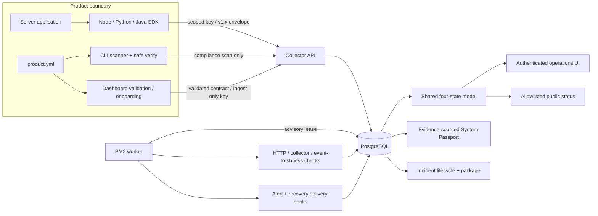

# Architecture

AI Product Reliability Kit is a small monorepo with one shared contract boundary and two deliberately separate evidence planes: operational runtime state and local compliance evidence.

## Components and Ownership

| Component | Responsibility | Explicit boundary |
| --- | --- | --- |
| Standard | Formal YAML parsing, product JSON Schema, telemetry JSON Schema, v1.x negotiation, deprecation and migration advice | Unknown major versions fail; compatible v1 minors remain readable |
| CLI | Declared/detected/verified scan evidence, exclusions, scoring, safe verification, passport/report output, compliance upload | It does not claim documents or placeholders are verified runtime controls |
| SDKs | Server-side envelope construction, bounded buffering, idempotency, timeout/retry/jitter, requeue, fail-open result, close flush | No browser/mobile secret storage; no durable disk queue |
| API | Auth, product scoping, validation/privacy, ingest, registry, incidents, maintenance, public projection, readiness | API process does not run the production scheduler |
| Worker | Due monitor execution, immediate SSRF revalidation, alert lifecycle/delivery, retention | PostgreSQL advisory lease permits only one active scheduling execution |
| Stores | Memory and atomic JSON for local work; PostgreSQL for production | Operational queries always accept product/environment filters |
| Dashboard | YAML/manual validated onboarding, keyed connectivity, action queue, product detail, incident operations, passport, key/publication controls | Client consumes server-derived state; it does not infer missing health as operational |
| Automation | Generates monitors, the four alert-rule types, a public-status draft, and incident-package template | Provider-neutral; no external service is contacted |
| Operations | Prepared/activated releases, atomic links, backup/restore/drill, two-process PM2, rollback, and manual Linux validation | No production deploy or external monitor activation occurs from repository automation |

## Runtime State Model

The authoritative unit is `product_id + environment`. `deriveEnvironmentStatus` combines only that unit's fresh health reports, configured monitor coverage and latest runs, active structured alert instances, and unresolved incidents:

1. A critical unresolved incident, critical active alert, repeated critical health failure, or repeated critical monitor failure yields `outage`.
2. A noncritical active incident/alert or current failing evidence yields `degraded`.
3. Missing/stale health, a configured critical monitor with no run, or stale critical-monitor evidence yields `unknown`.
4. Only fresh successful evidence with no active reason yields `operational`.

Fleet state is the highest-severity environment state. Compliance scan scores, documents, and Staging successes cannot improve Production runtime state.

## Alert and Incident Flow

Automation and the API accept only:

- `availability_failure`
- `telemetry_stale`
- `error_spike`
- `journey_drop`

Rules carry product, environment, window/sample/threshold configuration as appropriate. The worker evaluates due evidence, opens one stable deduplication instance, observes cooldown, preserves acknowledgement, resolves on recovery, and emits one recovery delivery. Active alert instances also feed the shared state model. Incidents are independent durable records with owner, severity, linked alerts, immutable timeline events, acknowledgement, resolution note, and reopen support.

Upgrades do not guess that a legacy free-form alert condition is safe. Migration 003 maps it to the closest structured type only for compatibility, disables the rule, preserves the original condition, and attaches migration advice. An operator must recreate and review an environment-scoped structured rule before enabling it.

## Data and Migration Model

Production uses PostgreSQL 16. Migration files are ordered, checksummed, recorded in `schema_migrations`, executed one file per transaction, and guarded by an advisory migration lock. The four current migrations cover the base schema, security/foundation records, runtime operations, and integrity/upgrade safety.

Migration 004 makes ingest replay protection consistent across telemetry types. The semantic key is `product_id + environment + idempotency_key`; the event table retains its legacy uniqueness shape through a compatibility trigger while returning the caller's original key. The same migration adds the shared deduplication ledger, backfills alert-instance rule types, archives duplicate legacy status pages before enforcing one row per product, and adds retention indexes.

Raw events, errors, health, and monitor runs have a configurable retention horizon. Cleanup first rolls up environment-isolated daily aggregates and then deletes eligible raw rows in the same PostgreSQL transaction. Complex partitioning is intentionally absent until data scale proves it necessary.

Local JSON storage persists through an atomic temporary-file rename. It is useful for development and demos, not a production substitute for PostgreSQL concurrency/durability.

## Security Boundaries

- Browser sessions use an HttpOnly, SameSite cookie after admin login.
- Master, ingest, and product keys use separate scopes; product keys cannot write/read another product.
- Product key secrets are revealed once and only SHA-256 hashes are stored.
- Production configuration fails closed for noncanonical binding, non-PostgreSQL storage, insecure URLs, malformed password hashes, missing trusted proxies, placeholder/shared secrets, or disabled auth.
- Request size, field lengths, timestamp skew/age, batch size, environment, and nested payload depth are validated.
- Sensitive field names are redacted and user/anonymous identifiers are HMAC transformed before persistence.
- Monitor targets reject credentials, private/link-local/loopback/multicast addresses, unsafe DNS answers, and are re-resolved immediately before fetch.
- Login, ingest, and general rate-limit buckets are independent; forwarded addresses are honored only from configured trusted proxies.
- Audit records describe sensitive operations without storing secret material.

Sensitive mutation coverage includes login attempts, product and compliance changes, monitor/alert/status-page registration, key create/rotate/revoke, incident lifecycle actions and packages, maintenance, alert acknowledgement, scheduler runs, and retention runs. Audit metadata is deliberately bounded and redacted; it is not a copy of the request body.

## Production Process and Release Model

Nginx terminates TLS and proxies only to `127.0.0.1:8787`. PM2 manages one API and one independent Worker from the atomic `current` link. Both handle SIGTERM/SIGINT; the API stops accepting new requests and drains in-flight work, while the Worker stops its timer and waits for an active leased task.

Deployment sequence is: prepare release → install production dependencies → verified `pg_dump` → compatible migrations → mark release ready → atomic link switch → PM2 stack reload → `/healthz` + `/readyz` and process-stability acceptance. Activated application contents are not edited in place; the documented `.deploy-failed` marker is the only diagnostic mutation to a failed release. A post-switch failure restores the prior link and process stack. Database migrations are forward-only, so every release-window migration must remain compatible with the retained prior application.

## Deliberate Non-Goals

This V1 is not a log platform, APM, replay system, BI/funnel suite, general alert DSL, feature-flag service, multi-tenant billing system, cross-product rollback platform, or vendor-plugin marketplace. External monitoring remains provider-neutral and manually activated because a host cannot prove its own external reachability.
