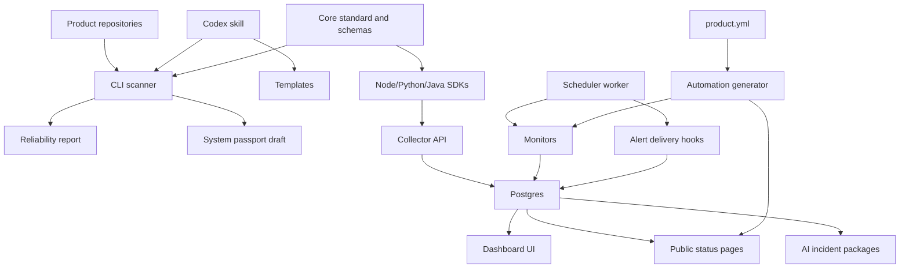
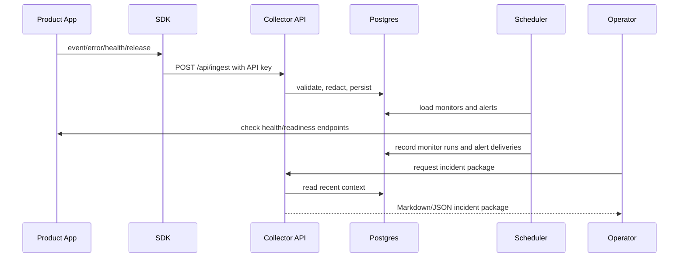

# Architecture

The kit is a monorepo with standards, SDKs, a CLI, a production dashboard, automation generators, templates, examples, and a Codex skill.

## Components

| Component | Responsibility |
| --- | --- |
| Standard | Defines the contract, ingestion protocol, compatibility rules, and operational documents. |
| CLI | Scans projects, reports gaps, registers products, and pushes scan telemetry to the dashboard. |
| SDKs | Send product, event, error, health, and release envelopes to the collector API with optional API key auth. |
| Dashboard | Provides authenticated product inventory, health, event, error, release, monitor, alert, and incident views. |
| Postgres store | Persists products, telemetry, monitors, monitor runs, alerts, status pages, and incident packages. |
| Scheduler | Executes HTTP, collector, and event freshness monitors, then records monitor runs and alert deliveries. |
| Automation | Generates monitor definitions, alert rules, status page drafts, and AI incident package templates from `product.yml`. |
| Skill | Guides AI agents to audit and improve projects consistently. |
| Templates | Provide reusable docs, CI, product contract, and smoke test templates. |

## Runtime Data Flow

Local development can use JSON storage. Production should use Docker Compose with Postgres, auth enabled, and worker enabled.
