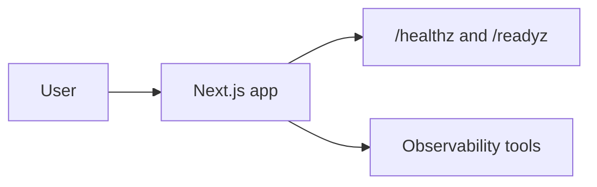

# System Passport

## Product

- Product ID: reliable-nextjs-example
- Product name: Reliable Next.js Example
- Owner: owner@example.com
- Production URL: https://example.com
- Standard version: 1.0

## Core Features

- Demonstrates health checks, release metadata, event naming, and documentation.

## Critical Journeys

| Journey | Success Event | Failure Event | Test |
| --- | --- | --- | --- |
| Signup | `user_signed_up` | `signup_failed` | `tests/playwright-smoke.spec.ts` |
| Core action | `core_action_completed` | `core_action_failed` | Manual placeholder |

## Architecture

## Runtime

- Language/framework: TypeScript and Next.js style routes.
- Deployment target: any Node-compatible web host.
- Database: not used in example.
- External services: Sentry and PostHog placeholders.

## Observability

- Error tracking: `captureError` placeholder for Sentry.
- Analytics/events: `trackEvent` placeholder for PostHog or equivalent.
- Logs: console with product ID and release in example.
- Uptime checks: `/healthz`.

## Release and Rollback

- Version source: `GIT_SHA` or platform Git SHA.
- CI pipeline: `.github/workflows/ci.yml`.
- Rollback guide: `docs/rollback.md`.

## Troubleshooting Entry Points

- Check `/healthz`, `/readyz`, current release, and recent errors.
- For journey failures, compare `success_event` and failure event counts by release.

