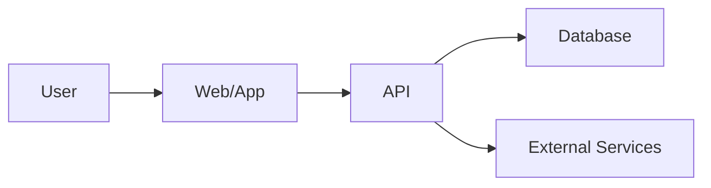

# System Passport

## Product

- Product ID:
- Product name:
- Owner:
- Production URL:
- Standard version:

## Core Features

-

## Critical Journeys

| Journey | Success Event | Failure Event | Test |
| --- | --- | --- | --- |
|  |  |  |  |

## Architecture

## Runtime

- Language/framework:
- Deployment target:
- Database:
- Storage:
- External services:

## Observability

- Error tracking:
- Analytics/events:
- Logs:
- Uptime checks:
- Status page:

## Release and Rollback

- Version source:
- CI pipeline:
- Rollback guide:

## Troubleshooting Entry Points

- Login issues:
- Payment issues:
- Core action issues:
- AI/API dependency issues:

